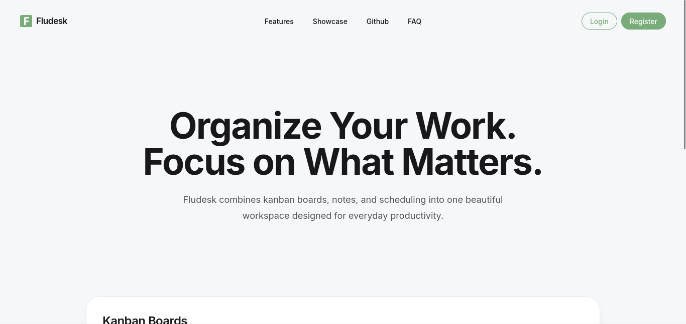
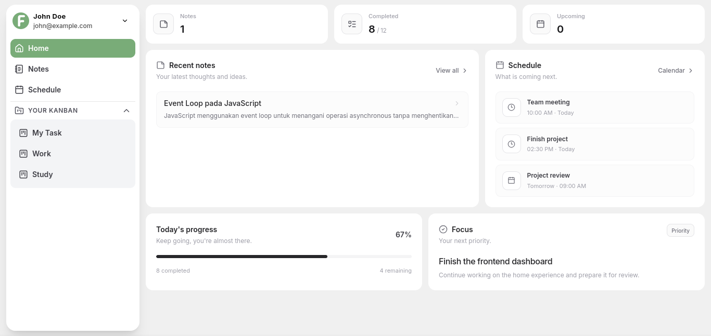

# Fludesk

A modern kanban board application with real-time collaboration, built with React and Node.js.

## Overview

Fludesk is a project management tool designed for teams to organize tasks, track progress, and collaborate efficiently. It provides an intuitive interface for managing projects through kanban boards with real-time updates.

## Features

### Authentication & User Management
- Secure user registration and login
- JWT-based authentication with refresh tokens
- Profile management with avatar support
- Session management with logout capabilities

### Project Management
- Kanban board organization
- Drag-and-drop task management
- Real-time collaboration
- Project member management

### File Management
- File upload and storage
- Avatar management
- Media organization

## Tech Stack

### Frontend
- React 19
- Vite 8
- TypeScript 6
- Modern CSS with preprocessing

### Backend
- Node.js
- Express 5
- TypeScript 6
- PostgreSQL
- JWT Authentication
- bcrypt for password hashing

### Development Tools
- pnpm for package management
- ESLint for code quality
- TypeScript for type safety

## Preview Image



## Installation

### Prerequisites
- Node.js 18+
- PostgreSQL 14+
- pnpm 8+

### Setup

1. Clone the repository
```bash
git clone <repository-url>
cd fludesk
```

2. Install dependencies
```bash
pnpm install
```

3. Configure environment variables

Create `.env` files in both `frontend/` and `backend/` directories:

**Backend `.env`**
```env
PORT=3000
DB_HOST=localhost
DB_PORT=5432
DB_NAME=fludesk_db
DB_USER=your_db_user
DB_PASSWORD=your_db_password
JWT_SECRET=your_jwt_secret
ACCESS_TOKEN_EXPIRY=15m
REFRESH_TOKEN_EXPIRY=7d
FILE_BASE_URL=http://localhost:3000/api/media
NODE_ENV=development
```

**Frontend `.env`**
```env
VITE_API_URL=http://localhost:3000
```

4. Setup database
```bash
cd backend
pnpm migrate
```

5. Start development servers
```bash
# Start both frontend and backend
pnpm dev

# Or start individually
cd frontend && pnpm dev
cd backend && pnpm dev
```

## Project Structure

```
fludesk/
├── frontend/
│   ├── src/
│   │   ├── components/
│   │   ├── pages/
│   │   ├── services/
│   │   └── types/
│   ├── public/
│   └── package.json
├── backend/
│   ├── config/
│   │   └── database.ts
│   ├── controllers/
│   ├── middlewares/
│   ├── migrations/
│   ├── repositories/
│   ├── routes/
│   ├── services/
│   ├── types/
│   ├── utils/
│   ├── uploads/
│   ├── app.ts
│   ├── index.ts
│   └── package.json
├── package.json
├── pnpm-workspace.yaml
└── README.md
```

## Development

### Available Scripts

**Root**
```bash
pnpm dev          # Start both frontend and backend
pnpm build        # Build both frontend and backend
pnpm lint         # Lint both frontend and backend
pnpm typecheck    # Type check both frontend and backend
```

**Backend**
```bash
cd backend
pnpm dev          # Start development server with hot reload
pnpm start        # Start production server
pnpm migrate      # Run database migrations
pnpm typecheck    # Run TypeScript type checking
```

**Frontend**
```bash
cd frontend
pnpm dev          # Start development server with hot reload
pnpm build        # Build for production
pnpm preview      # Preview production build
```

### Code Style

The project follows TypeScript best practices:
- Strict type checking enabled
- Type-only imports for types
- Consistent naming conventions
- ESLint for code quality

### Security Considerations

- Passwords are hashed using bcrypt with 10 salt rounds
- JWT tokens use environment variable secrets
- Access tokens expire in 15 minutes
- Refresh tokens expire in 7 days
- Passwords are never exposed in API responses
- HttpOnly cookies for token storage
- CORS configuration for frontend-backend communication

## Deployment

### Environment Variables

Ensure all required environment variables are set in production:

**Backend**
- `PORT` - Server port
- `DB_HOST` - Database host
- `DB_PORT` - Database port
- `DB_NAME` - Database name
- `DB_USER` - Database user
- `DB_PASSWORD` - Database password
- `JWT_SECRET` - JWT signing secret
- `ACCESS_TOKEN_EXPIRY` - Access token expiration
- `REFRESH_TOKEN_EXPIRY` - Refresh token expiration
- `FILE_BASE_URL` - Base URL for file uploads
- `NODE_ENV` - Environment (production/development)

**Frontend**
- `VITE_API_URL` - Backend API URL

### Build Process

```bash
# Build frontend
cd frontend
pnpm build

# Backend uses tsx for runtime compilation
# No build step required
```

## Contributing

1. Fork the repository
2. Create a feature branch (`git checkout -b feature/amazing-feature`)
3. Commit your changes (`git commit -m 'Add amazing feature'`)
4. Push to the branch (`git push origin feature/amazing-feature`)
5. Open a Pull Request

### Development Guidelines

- Follow the existing code structure
- Write TypeScript with strict type checking
- Add appropriate error handling
- Update documentation for API changes
- Run type checking before committing
